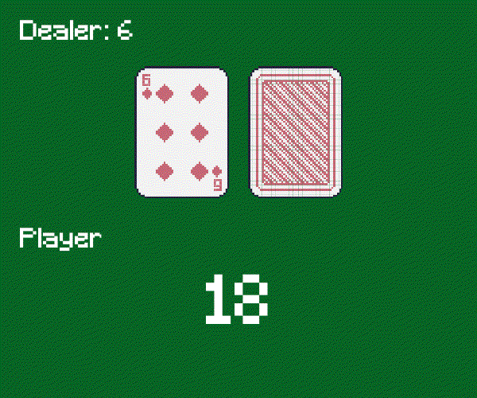

# Black Jack Reinforcement Learning

Welcome to our Black Jack Reinforcement Learning project! In this project, we're developing an agent that can play the classic card game, Blackjack, using Reinforcement Learning (RL) techniques. RL is a subfield of machine learning that trains agents to make decisions in an environment by maximizing a reward signal. We'll be using the following [OpenAI Gym environment](https://gymnasium.farama.org/environments/toy_text/blackjack/) to implement the game and test our agents.

Our team of contributors includes:

|Name                    |Email                              |
|------------------------|-----------------------------------|
|Jorge Ayuso Martínez    |jorgeayusomartinez@alu.comillas.edu|
|Javier Gisbert          |202208977@alu.comillas.edu         |
|Carlota Monedero Herranz|carlotamoh@alu.comillas.edu        |
|Diego Sanz-Gadea        |d.sanz-gadea@alu.icai.comillas.edu |
|José Manuel Vega Gradit |josemanuel.vega@alu.comillas.edu   |

Blackjack is a classic card game where the objective is to get a higher card value than the dealer, without exceeding 21. At the start of each round, the dealer deals two cards to the player, both of which are face-up, and two cards to themselves, one of which is face-down. The player can then choose to "Hit," receiving an additional card, or "Stand," keeping their current hand value. If the player's hand value exceeds 21, they "Bust" and automatically lose the game. The game ends when either the player or the dealer gets a hand value of 21 or as close to it as possible without exceeding it. 

In our environment, you can see the sum of the player's cards and one of the dealer's cards, which is facing up. You will also be informed if you have a usable Ace, which counts as either 1 or 11 depending on your hand's value. You can watch a short example GIF below to get an idea of our environment and the gameplay:

We'll be comparing the performance of multiple Reinforcement Learning techniques, including Q-Learning, Deep Q-Network (DQN), Policy Gradient, and Advantage Actor-Critic (A2C).

+ Q-Learning: A model-free algorithm that learns a Q-function which estimates the expected future reward of taking a particular action in a particular state. It works by exploring the game space and learning from the rewards that it receives from the environment. By using an epsilon-greedy policy, it balances the trade-off between exploration and exploitation, which means that the agent will occasionally take a random action to explore new possibilities and avoid getting stuck in a suboptimal policy.
+ DQN: A Deep Learning-based approach to RL that uses a Neural Network to approximate the Q-function. It combines Q-Learning with experience replay to improve sample efficiency and stability during training. Experience replay means that the agent stores its experiences and learns from them at a later time, which allows for more efficient use of the data and reduces the risk of the agent getting stuck in a particular state.
+ Policy Gradient: Another model-free algorithm that directly learns the optimal policy by maximizing the expected cumulative reward. It updates the policy parameters through gradient ascent, which means that it takes small steps in the direction that most improves the expected reward. This algorithm can handle continuous action spaces, which means that the agent can take actions that are not limited to discrete options.
+ A2C: An algorithm that combines both policy gradient and value function approximation to learn a policy and estimate the value function. In this algorithm, the policy is represented as an "actor" and the value function as a "critic". By estimating the value function, the agent can learn to predict the expected future rewards, which can help it choose better actions. This algorithm updates both the policy and value function parameters concurrently, which can lead to faster and more efficient training.

To evaluate the effectiveness of the reinforcement learning techniques we're implementing, we'll measure the win rate of each agent after a fixed number of training episodes.

We've created a video showcasing the gameplay of our best-performing agent, which was trained using DQN. You can find this video in the `docs/imgs/results_video.gif` directory and watch it to see how the agent plays against the dealer. We've also included an extract of the video below for your convenience:

In addition, we've created a detailed report in Spanish, which you can find in `docs/Memoria_RL_BlackJack.pdf`. This report describes the results of our experiments, including a more in-depth explanation of the reinforcement learning algorithms we implemented and an analysis of their suitability for the Blackjack game. We encourage you to read this report to gain a deeper understanding of our project and our findings.

In conclusion, this project will provide a practical example of how reinforcement learning techniques can be used to train an agent to play a challenging game like Blackjack. By comparing the performance of different algorithms, we will gain insights into the strengths and weaknesses of each technique and their suitability for different types of problems.